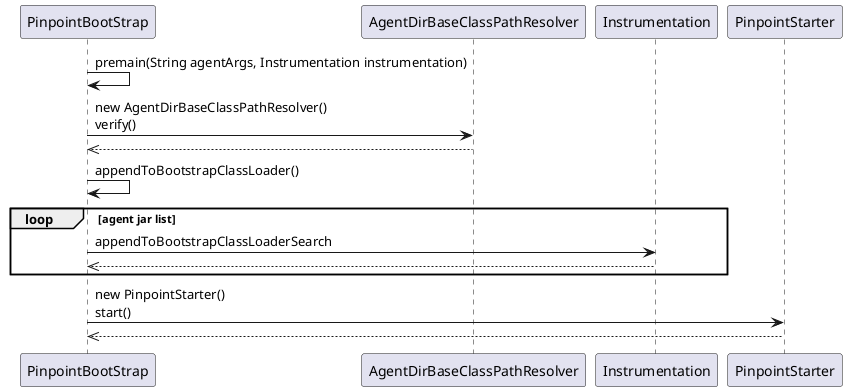
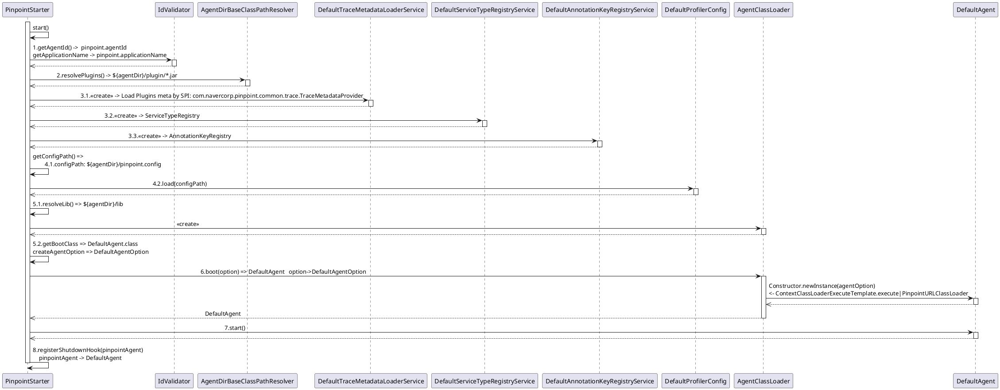

Pinpoint 1.6.1 Agent启动过程
==================================================================

##  分析前准备工作

#### 编译pinpoint
  
进入pinpoint目录， 通过maven命令`mvn package -Dmaven.test.skip=true`打包。测试一直过不去，不要紧，跳过测试。
  
agent的target下，pinpoint-agent-1.6.1-SNAPSHOT.tar.gz解压出来使我们要用到agent包和相关jar包和配置文件。 
  
web和collector的target下的war包，分别是pinpoint的web段和收集器的应用war包。 
  
#### 部署pinpoint 

部署可以参考网上文章[PinPoint分布式全链路监控搭建](https://www.jianshu.com/p/d4c6104a2005)。

后续再写篇部署的文章吧。 

   

##  参数配置

####  agent配置文件 

pinpoint-agent-1.6.1-SNAPSHOT.tar.gz解压出来后，配置文件中可以配置全局参数及各个插件用到的参数。 

分析agent源码，我们只需要设置好`profile.collector.ip`成我们部署的收集器（`collector`）的ip就可以。 

####  应用启动参数

编写一个简单的hello-world应用， 设置虚拟机启动参数，加上:

```shell
    -javaagent:${agent的目录}/pinpoint-bootstrap-1.6.1-SNAPSHOT.jar
    -Dpinpoint.agentId=hello-world-1
    -Dpinpoint.applicationName=hello-world
```

然后启动调试hello world应用，我们就可以愉快地打断点调试pinpoint的agent源码了。 

    

##  启动过程分析  

####  pinpoint agent的启动类PinpointBootStrap

pinpoint采用Java Agent的方式，通过字节码增强技术，实现无侵入式的调用链数据采集。 

Java Agent约定的启动类在`MANIFEST.MF`文件中的`Premain-Class`指定， 编译后的Jar包中可以找到对应的入口点`com.navercorp.pinpoint.bootstrap.PinpointBootStrap`

```properties
Manifest-Version: 1.0
Premain-Class: com.navercorp.pinpoint.bootstrap.PinpointBootStrap
Archiver-Version: Plexus Archiver
Built-By: 1
Can-Redefine-Classes: true
Pinpoint-Version: 1.6.1-SNAPSHOT
Can-Retransform-Classes: true
Created-By: Apache Maven 3.6.2
Build-Jdk: 1.8.0_221
```

PinpointBootStrap的premain方法是入口点。 在premain中，通过AgentDirBaseClassPathResolver解析java.class.path系统参数，得到pinpoint agent目录及各个jar包的路径。包括`pinpoint-bootstrap-x.x.x(-SNAPSHOT).jar、pinpoint-commons-x.x.x(-SNAPSHOT).jar、pinpoint-bootstrap-core-x.x.x(-SNAPSHOT).jar、pinpoint-bootstrap-core-x.x.x(-SNAPSHOT).jar、pinpoint-bootstrap-core-optional-x.x.x(-SNAPSHOT).jar`这5个jar包。 然后将这些jar包添加到Instrument的启动类加载器（Boostrap Class Loader）的类搜索路径中。然后调用PinpointStarter的start完成启动。 




####  PinpointStarter的starter流程

1. 首先，获取启动参数的agentId和appliactionName；
2. 然后，获取插件的路径；
3. 再通过 `DefaultTraceMetadataLoaderService`, `DefaultServiceTypeRegistryService`, `DefaultAnnotationKeyRegistryService`，加载并注册插件的`ServiceType`和`AnnotationKey`；
4. 获取`pinpoint.config`路径，通过`DefaultProfileConfig`加载配置文件；
5. 创建`AgentClassLoader`,构造方法中会创建一个类加载器`PinpointURLClassLoader`，用来加载pinpoint自己依赖的`${agentDir}/lib`下的jar包，然后，获取`bootClass`,默认是`DefaultAgent`类，设置给`AgentClassLoader`；再将一系列参数通过`createAgentOption`包装成参数对象`DefaultAgentOption`；
6. 调用`AgentClassLoader`的boot方法，通过`PinpointURLClassLoader`类加载器，加载并创建`DefaultAgent`类对象，`DefaultAgent`构造方法会通过`DefaultApplicationContext`完成google的IOC容器Guice初始化和加载，这里干了一堆活；
7. 完成`DefaultAgent`对象创建后，调用`start()`方法，这里通过`AgentInfoSender`启动agent信息定时上报任务，默认3秒一次；通过`DefaultAgentStatMonitor`启动agent状态信息(JVM/内存/CPU等)上报服务，默认5秒一次。
8. 调用`registerShutdownHook`方法注册一个shutdown的钩子线程，用来关掉各种发送数据的线程和链接。



######  pinpoint依赖的第三方包隔离(不重要，可跳过) 

`AgentClassLoader` 并不是一个类加载器， 构造方法中创建类加载器`PinpointURLClassLoader`，然后创建`ContextClassLoaderExecuteTemplate`实例。
`boot`方法中，用`ContextClassLoaderExecuteTemplate`的`execute`方法通过反射， 创建DefaultAgent对象。这里需要注意的是execute方法： 

```java
 final Thread currentThread = Thread.currentThread();
 final ClassLoader before = currentThread.getContextClassLoader();
 currentThread.setContextClassLoader(ContextClassLoaderExecuteTemplate.this.classLoader);
 try {
     return callable.call();
 } finally {
     currentThread.setContextClassLoader(before);
 }
```

这个方法在创建DefaultAgent前，更改了线程上下文的类加载器(默认没被替换的情况下应该是`sun.misc.Launcher$AppClassLoader)`成`PinpointURLClassLoader`。 那我们就要看下这个类加载器有什么特殊的设计了。
 
首先,`PinpointURLClassLoader`继承自`URLClassLoader`,构造方法中将${agentDir}/lib下所有jar包的URL设置给父类的ucp；
然后， `loadClass`方法中: 

```java
    ...
    if (onLoadClass(name)) {
        // load a class used for Pinpoint itself by this PinpointURLClassLoader
        clazz = findClass(name);
    } 
    ...
```

`onLoadClass(name)`做了类判断，确定是否由该类加载器加载。 实际判断是由`ProfilerLibClass`的`PINPOINT_PROFILER_CLASS`预先设定的包确定的，这些包就是${agentDir}/lib下，pinpoint依赖的第三方jar。
 
 #### DefaultApplicationContext--agent的真正启动过程 

```puml
@startuml 


@enduml 
```