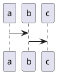

# Pinpoint 1.6.1 Agent启动过程

```puml
@startuml 
    a -> b 
    b -> c 
@enduml 
```

```puml
@startuml 
    a -> b 
    b -> c 
@enduml 
```

```puml
@startuml 
    a -> b 
    b -> c 
@enduml 
```

```puml
@startuml 
    a -> b 
    b -> c 
@enduml 
```

```puml
@startuml 
    a -> b 
    b -> c 
@enduml 
```

```puml
@startuml 
    a -> b 
    b -> c 
@enduml 
```

```puml
@startuml 
    a -> b 
    b -> c 
@enduml 
```

```puml
@startuml 
    a -> b 
    b -> c 
@enduml 
```

